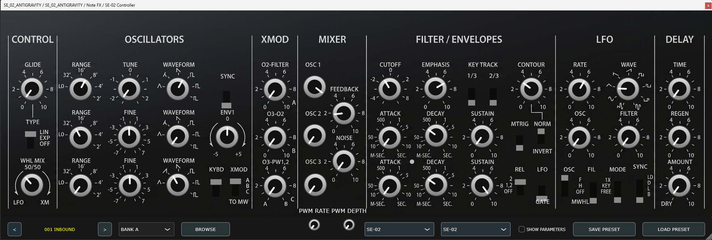
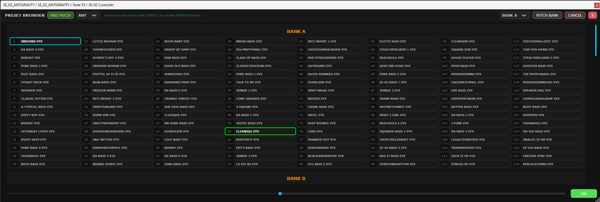

# Roland SE-02 Unofficial VST3 Editor & SysEx Documentation

Welcome to the open-source SE-02 Controller! This project contains a fully functional VST3 / Standalone editor for the Roland SE-02 analog synthesizer. 

More importantly, this repository serves as a **comprehensive technical whitepaper** documenting the SE-02's completely undocumented System Exclusive (SysEx) implementation. Roland and Studio Electronics have never released official MIDI implementation charts for patch fetching or the Setup menu parameters. Through meticulous reverse-engineering of the USB MIDI streams, we have mapped out the communication protocol so the global community can build their own librarians, editors, and controllers.

<p align="center">
  
</p>
<p align="center">
  
</p>

---

## 🎹 The Plugin Features
- **Bi-directional Sync:** Twist a knob on the SE-02 hardware, and the VST GUI updates instantly. Twist a GUI knob, and the hardware responds.
- **SysEx Patch Fetching:** Pulls the active Temporary Patch (Edit Buffer) directly from the hardware into the plugin, automatically parsing all 120 parameters into the VST's state.
- **Smart Categorized Randomizer:** Intelligently generates highly playable patches based on musical constraints (Bass, Lead, Pluck, Pad) rather than pure chaos.
- **Offline Preset Browser:** Complete management of all 512 Factory and User patches directly from the plugin interface. Instantly browse, load, and recall patches without menu-diving.
- **Custom Bank Management:** Native support for reading and writing standard `.syx` (SysEx) and `.prm` files. The "CUSTOM" section of the browser allows you to load and manage an unlimited number of your own custom patches directly from your hard drive.
- **DAW Passthrough Mode:** Built specifically for older Windows 10 machines with single-client MIDI constraints. The plugin intelligently intercepts the DAW's generic track MIDI, processes it, and injects outgoing automated parameters back into the DAW pipeline to bypass exclusive OS port locking.
- **Undocumented Parameters:** Full access to the Firmware v1.10 `PWM LFO RATE` and `PWM LFO DEPTH` parameters which lack CC numbers and are otherwise buried in the hardware's Setup menu.

---

## 🛠 Building the Source
This project uses the JUCE Framework and CMake.

```bash
# Clone the repository
git clone https://github.com/your-username/SE02_Controller.git
cd SE02_Controller

# Configure and Build
cmake -B build -G "Visual Studio 17 2022"
cmake --build build --config Release
```

---

## 🔍 The SysEx Whitepaper

The SE-02 adheres to standard Roland SysEx formatting. All commands are wrapped in:
- `F0 41 10 00 00 00 44` (SysEx Start + Roland ID + Device ID + SE-02 Model ID)
- `[Command]` (`11` for RQ1 Request, `12` for DT1 Data Transfer)
- `[Address 1] [Address 2] [Address 3] [Address 4]` (Target Memory Address)
- `[Payload]`
- `[Checksum]`
- `F7` (SysEx End)

### 1. The Edit Buffer Address
The active Temporary Patch (the sound currently loaded and being played on the hardware) resides at base address `05 00 00 00`.

### 2. Fetching a Patch (RQ1)
When requesting the Edit Buffer, you cannot ask for it all at once. You must send exactly **4 sequential Request Messages (RQ1)**. The SE-02 responds with **4 chunks of data (DT1)**.

1. **Request 1:** `... 11 05 00 00 00 00 00 00 40 3B F7` (Requests 64 bytes) -> Responds with 78 bytes.
2. **Request 2:** `... 11 05 00 00 40 00 00 00 40 7B F7` (Requests 64 bytes) -> Responds with 78 bytes.
3. **Request 3:** `... 11 05 00 01 00 00 00 00 40 3A F7` (Requests 64 bytes) -> Responds with 78 bytes.
4. **Request 4:** `... 11 05 00 01 40 00 00 00 30 0A F7` (Requests 48 bytes) -> Responds with 62 bytes.

### 3. The Nibblized Payload 
Unlike standard 8-bit MIDI parameters, the SE-02 packs its analog continuous knobs as 0-255 (`0x00` to `0xFF`). Because MIDI bytes cannot exceed 127 (`0x7F`), Roland **nibblizes** the payload.

For every single 8-bit parameter, the SE-02 splits it into two consecutive SysEx bytes (nibbles):
- The first byte contains the High Nibble (`0x0` to `0xF`)
- The second byte contains the Low Nibble (`0x0` to `0xF`)

To reconstruct the actual value in C++:
```cpp
juce::uint8 actualValue = ((highNibble & 0x0F) << 4) | (lowNibble & 0x0F);
```

### 4. Parameter Value Scaling
Because the hardware SE-02 reads analog pots internally at a 0-255 resolution, the SysEx dumps provide values mapped across 0-255.
However, standard MIDI CCs are only 0-127.
- **Continuous Parameters** (e.g., Cutoff, Resonance): Mapped linearly `(sysExVal / 255.0) * 127.0`.
- **Discrete Switches** (e.g., VCO1 Waveform): The SysEx provides the mathematically perfect dividing slices of 255 (e.g., 0, 51, 102, 153, 204, 255).
- **PWM LFO Rate & Depth (Exception):** Added in firmware v1.10 as pure digital Setup menu parameters, these are strictly clamped to `0-127` natively inside the SysEx dump and do NOT scale up to 255.

### 5. Writing to the Edit Buffer (DT1)
To update a single parameter (like PWM LFO RATE) directly to the hardware without a CC number, you send a DT1 packet to the Edit Buffer address with the calculated offset.

For example, PWM LFO Rate is at offset 12/13.
Address: `05 00 00 0C`.
```cpp
// Update PWM LFO Rate to 127 (0x7F)
F0 41 10 00 00 00 44 12 05 00 00 0C 07 0F [Checksum] F7
```
*(Notice how 127 is nibblized into `07` and `0F`)*

---

### Acknowledgements
This project was heavily inspired by the reverse-engineering pioneers of the Electra One community, whose early packet sniffing provided the foundation for unlocking the SE-02's SysEx implementation.

### Legal Disclaimer
This is an unofficial, community-built tool. It is not affiliated with, endorsed by, or supported by Roland Corporation or Studio Electronics. All trademarks and registered trademarks are the property of their respective owners. Reverse-engineering of the MIDI protocol was conducted strictly via public data observation for interoperability purposes.
